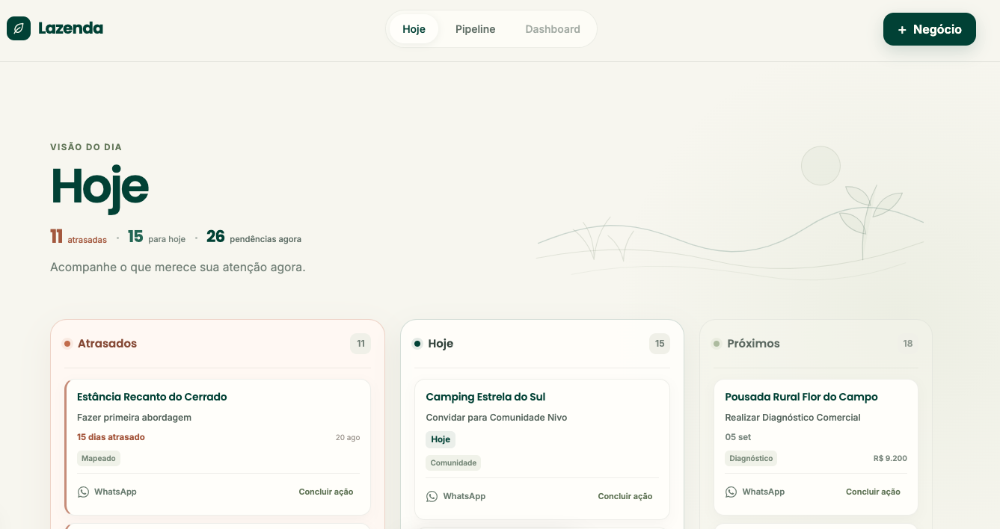

<div align="center">

# Lazenda

**Open source CRM built around the next action.**

Know who needs attention.<br>
Know where every relationship stands.<br>
Know what to do next.

[English](README.md) · [Português](README.pt-BR.md) · [Español](README.es.md)

[](LICENSE)


</div>

Lazenda is an open source CRM for startups and small teams, built from real operational use.

Most CRMs are designed to keep records accurate. Lazenda is also designed to keep work moving.

At the center of the product is a simple question:

> **What should I do next?**

## Product preview



## Why Lazenda

Many CRMs answer: “What do we know about this relationship?” Lazenda also asks: “What needs to happen next?”

The product connects a simple operational cycle:

**Relationship → Next action → Movement → History → Learning**

Lazenda brings those steps into one operational flow. The current focus is the beginning of that cycle: making relationships, pipeline position, and next actions clear enough to guide daily work.

## Current product

The following capabilities are available today.

### Today

- Separates overdue businesses, actions due today, and upcoming actions.
- Supports day-to-day operational prioritization.
- Lets a user complete the current action and define the next action and date.
- Shows relevant business context, including potential value and a WhatsApp shortcut when available.

### Pipeline

- Kanban view across the current commercial stages.
- Drag and drop between stages, persisted in Supabase.
- Search by business or contact and filters by stage, municipality, district, and attention status.
- Business cards with next action, due date, potential value, and WhatsApp shortcut.

### Business management

- Create, view, edit, and delete businesses.
- Store business name, contact, WhatsApp, municipality, district, source, notes, potential value, next action, and date.

### Location structure

- Structured municipality and district selection.
- Districts are associated with their municipality.

### Persistence

- Business and location data are read from and written to Supabase.
- PostgreSQL is the underlying database.

Authentication, multi-user support, complete history, automations, AI, a public API, and webhooks are **not current features**. See the [roadmap](#roadmap) for planned and exploratory work.

## Product principles

- **Action over administration.** The CRM should help someone act, not only maintain records.
- **Every open relationship should have a next action.** Momentum starts with a clear owner action and date.
- **Simple before sophisticated.** Add complexity only when real use proves it necessary.
- **Operational clarity over CRM bureaucracy.** Important work should be easy to identify and move forward.
- **Real usage before feature expansion.** Product decisions should be grounded in practical workflows.
- **Open code, private data.** The software can be public while credentials and operational data remain protected.

## Project status

> **Lazenda is under active development.**

The product is being used and developed iteratively. The database schema, internal APIs, setup process, and features may change. The repository does not yet include reproducible database migrations, authentication, or documented Row Level Security policies.

Do not use Lazenda for security-critical production workloads without an independent security review and an appropriate Supabase Auth and RLS configuration.

## Roadmap

Everything below is roadmap—not a description of current functionality. Ordering is directional, carries no delivery-date commitment, and may change as the product learns from real use.

### Now

- Open source foundation
- Authentication
- Session management
- Protected routes
- Supabase RLS and security

### Next

- Commercial event and history model
- Reliable dashboard and metrics

### Later

- Business 360
- Structured diagnosis and workflow
- Customer and result tracking
- Territorial intelligence
- Useful automations

### Exploring

- Custom pipelines and fields
- Workspaces
- Import and export
- Public API and webhooks
- Integrations
- AI-assisted workflows

## Getting started

### Prerequisites

- Git
- A compatible Node.js LTS release
- npm
- A Supabase project

### 1. Clone the repository

```bash
git clone https://github.com/nivo-tur/lazenda.git
cd lazenda
```

### 2. Install dependencies

```bash
npm install
```

### 3. Configure the environment

```bash
cp .env.example .env.local
```

Add your Supabase project URL and Publishable Key to `.env.local`:

```dotenv
NEXT_PUBLIC_SUPABASE_URL=
NEXT_PUBLIC_SUPABASE_PUBLISHABLE_KEY=
```

Never place a Supabase Secret Key or `service_role` key in a `NEXT_PUBLIC_*` variable. Anything prefixed with `NEXT_PUBLIC_` is available to browser code.

### 4. Configure Supabase

The repository does not yet contain migrations or a reproducible schema for the required `businesses` and `locations` data. Database setup is still being documented; do not invent or infer production tables from the application code.

### 5. Run locally

```bash
npm run dev
```

Open [http://localhost:3000](http://localhost:3000).

## Environment variables

| Variable | Required | Description |
| --- | :---: | --- |
| `NEXT_PUBLIC_SUPABASE_URL` | Yes | URL of the Supabase project used by the browser client. |
| `NEXT_PUBLIC_SUPABASE_PUBLISHABLE_KEY` | Yes | Supabase Publishable Key used by the browser client according to Supabase's security model. |

Publishable keys are designed for client use when database access is protected appropriately. Secret Keys and `service_role` keys bypass or elevate access and must never be exposed through `NEXT_PUBLIC_*`, sent to the browser, or committed.

## Architecture

The current application has a direct browser-to-Supabase data path:

```text
Browser
  ↓
Next.js application
  ↓
Supabase JavaScript client
  ↓
Supabase / PostgreSQL
```

This makes Supabase Auth and RLS essential before production use. Those controls are part of the current security roadmap, not completed features.

## Project structure

```text
app/          Next.js App Router page, views, forms, and product UI
lib/          Shared integrations, currently the Supabase client
public/       Static assets served by Next.js
docs/images/  Reserved for public documentation images
```

## Development

| Command | Purpose |
| --- | --- |
| `npm run dev` | Start the local Next.js development server. |
| `npm run build` | Create a production build. |
| `npm run start` | Serve a previously created production build. |
| `npm run lint` | Run ESLint. |

There is currently no separate type-check script.

## Security

**Public code does not mean public data.** Lazenda is intended to combine public source code with private credentials, a protected database, and private operational data.

Read [SECURITY.md](SECURITY.md) before reporting a vulnerability or configuring a deployment. Authentication and RLS remain required security work; this repository should not yet be considered production-secure by default.

## Contributing

Issues, suggestions, and pull requests are welcome. Because the project is still early, please discuss substantial changes in an issue before investing in implementation. Keep contributions focused, avoid real customer or production data, and clearly separate current behavior from proposed features.

## Open source and Nivo

Lazenda is open source and is currently being developed from real operational use at Nivo. Nivo is the initial operating environment, but the long-term goal is to make the core useful beyond a single organization.

This repository documents the product itself—not Nivo's private processes, commercial information, or operational data.

## License

Licensed under the [MIT License](LICENSE).
